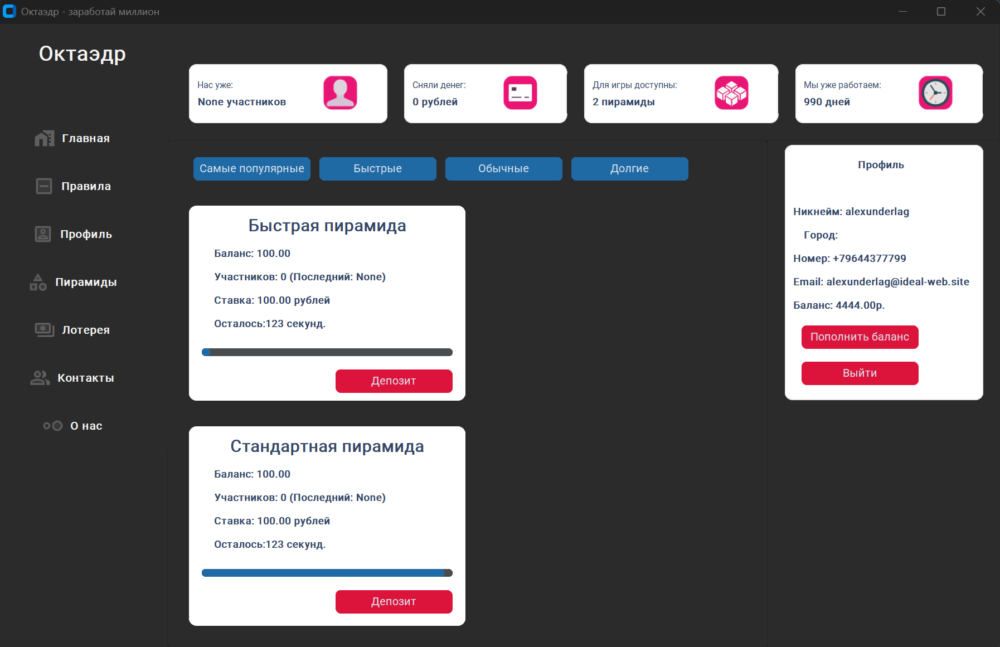

# Октаэдр

**Октаэдр** — учебный проект, моделирующий работу финансовой пирамиды в формате клиент-серверного приложения.

## О проекте
Проект был выполнен в учебных целях для отработки навыков:
- разработки графического интерфейса на Python;
- создания REST API;
- работы с базой данных MySQL;
- авторизации пользователей;
- организации взаимодействия между клиентом и сервером.
Основная идея и экономическая суть пирамиды, её механика и назначение в рамках учебной работы подробнее описаны в презентации, приложенной к проекту.

## Стек технологий
### Клиентская часть
- Python
- Tkinter
- CustomTkinter
- requests
- PIL
- CTkTable
- CTkToolTip
- CTkMessagebox

### Серверная часть
- Python
- Flask
- Flask-JWT-Extended
- mysql-connector-python
- bcrypt

### База данных
- MySQL

## Как устроен проект
Проект состоит из двух частей:

1. **Клиентское приложение**
   - реализует графический интерфейс;
   - позволяет пользователю регистрироваться и входить в систему;
   - отображает данные о пирамидах;
   - показывает список пользователей;
   - позволяет пополнять баланс и делать депозит.

2. **Серверное приложение**
   - обрабатывает запросы от клиента;
   - выполняет регистрацию и авторизацию пользователей;
   - работает с JWT-токенами;
   - хранит данные пользователей и пирамид в MySQL;
   - рассчитывает текущее состояние пирамид и время до завершения цикла.

## Основные возможности
- регистрация пользователя;
- вход в аккаунт;
- просмотр профиля;
- пополнение баланса;
- участие в пирамидах;
- просмотр списка пользователей;
- отображение статистики и служебной информации;
- автоматическое обновление данных по таймеру.

## Принцип работы
Пользователь регистрируется и авторизуется в системе. После входа он может пополнить баланс и использовать средства для участия в пирамиде. Сервер хранит данные о пользователях, балансе, количестве участников и времени завершения цикла. Клиентская часть регулярно получает актуальную информацию через API и отображает её в интерфейсе.

## Примечание
Данный проект является **учебной работой**.  
Описание механики финансовой пирамиды и её концепции приведено в презентации, приложенной к проекту.
